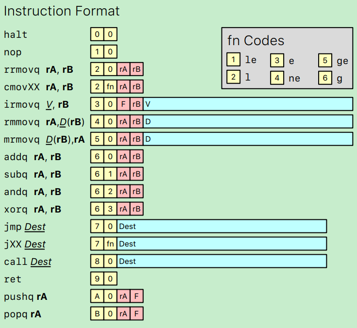
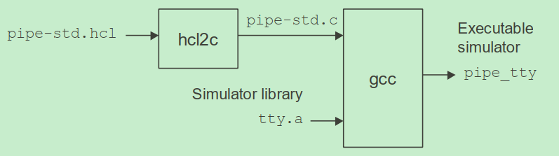
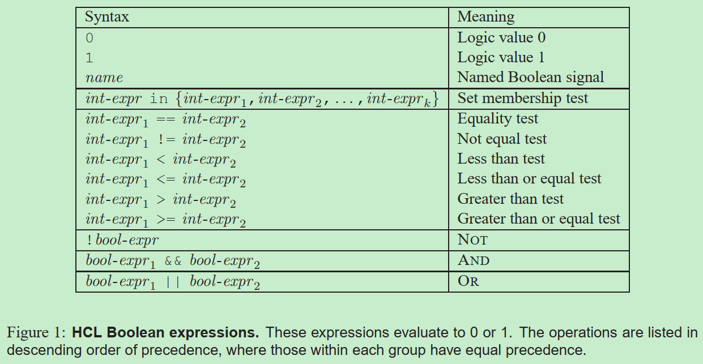
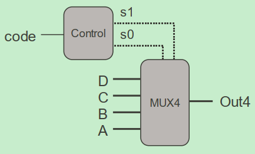

# Introduction
This project is used to learning Y86-64 processor simulator. For details, please refer to
* http://csapp.cs.cmu.edu
* https://w3.cs.jmu.edu/lam2mo/cs261_2019_08/y86-intro.html
* https://github.com/sysprog21/y86_64-tools

# Y86-64 Assembler
[Y86-64汇编器](assembler)在`flex`的帮助下将汇编代码转换成了机器码。

## Purpose
To implement a lexer for Y86-64 processor. Then we can use is to convert Y86-64 assembly code to machine code. For example, the assembly code below (right part) can be converted to the machine code below (left part).

```bash
                            | # Execution begins at address 0 
0x000:                      | 	.pos 0
0x000: 30f40002000000000000 | 	irmovq stack, %rsp  	# Set up stack pointer
0x00a: 803800000000000000   | 	call main		# Execute main program
0x013: 00                   | 	halt			# Terminate program 
                            | 
                            | # Array of 4 elements
0x018:                      | 	.align 8
0x018: 0d000d000d000000     | array:	.quad 0x000d000d000d
0x020: c000c000c0000000     | 	.quad 0x00c000c000c0
0x028: 000b000b000b0000     | 	.quad 0x0b000b000b00
0x030: 00a000a000a00000     | 	.quad 0xa000a000a000
                            | 
0x038: 30f71800000000000000 | main:	irmovq array,%rdi
0x042: 30f60400000000000000 | 	irmovq $4,%rsi
0x04c: 805600000000000000   | 	call sum		# sum(array, 4)
0x055: 90                   | 	ret
                            | 
                            | # long sum(long *start, long count)
                            | # start in %rdi, count in %rsi
0x056: 30f80800000000000000 | sum:	irmovq $8,%r8        # Constant 8
0x060: 30f90100000000000000 | 	irmovq $1,%r9	     # Constant 1
0x06a: 6300                 | 	xorq %rax,%rax	     # sum = 0
0x06c: 6266                 | 	andq %rsi,%rsi	     # Set CC
0x06e: 708700000000000000   | 	jmp     test         # Goto test
0x077: 50a70000000000000000 | loop:	mrmovq (%rdi),%r10   # Get *start
0x081: 60a0                 | 	addq %r10,%rax       # Add to sum
0x083: 6087                 | 	addq %r8,%rdi        # start++
0x085: 6196                 | 	subq %r9,%rsi        # count--.  Set CC
0x087: 747700000000000000   | test:	jne    loop          # Stop when 0
0x090: 90                   | 	ret                  # Return
                            | 
                            | # Stack starts here and grows to lower addresses
0x200:                      | 	.pos 0x200
0x200:                      | stack:
```

## Flex程序: yas-grammar.lex
### option配置
```lex
%option noinput
%option nounput
```
* noyywrap表示不需要自定义的`yywrap()`，默认返回1，代表只进行一次文件扫描
    * 例子中自定义了`yywrap()`函数，可在最后打印symbol table
* noinput表示不添加`input()`函数，以消除编译警告`warning: ‘input’ defined but not used`
* nounput表示不添加`yyunput()`函数，以消除编译警告`warning: ‘yyunput’ defined but not used`

### 声明
```lex
%{
#include "yas.h"
%}
```
* 此部分代码会被原样搬到生产的C文件的开头部分
* 头文件里主要包括了相关函数和变量的声明

### 定义段
```lex
%option noyywrap
%option noinput
%option nounput

Instr         rrmovq|cmovle|cmovl|cmove|cmovne|cmovge|cmovg|rmmovq|mrmovq|irmovq|addq|subq|andq|xorq|jmp|jle|jl|je|jne|jge|jg|call|ret|pushq|popq|"."byte|"."word|"."long|"."quad|"."pos|"."align|halt|nop|iaddq
Letter        [a-zA-Z]
Digit         [0-9]
Ident         {Letter}({Letter}|{Digit}|_)*
Hex           [0-9a-fA-F]
Blank         [ \t]
Newline       [\n\r]
Return        [\r]
Char          [^\n\r]
Reg           %rax|%rcx|%rdx|%rbx|%rsi|%rdi|%rsp|%rbp|%r8|%r9|%r10|%r11|%r12|%r13|%r14

/* ERR condition is started if no token is matched */
%x ERR
```
* 各种选项
    * `%option noyywrap`
* 正则表达式和状态定义
    * `Instr`匹配了所有Y86的指令名，所有指令可参考：[Y86-64 Reference](doc/Y86-64 Reference.pdf)
    * `Reg`匹配了15个寄存器ID
* 状态定义
    * `ERR`定义了error状态，通过`BEGIN ERR`跳转到此状态
    * `0`是默认初始状态

### 规则段
```lex
^{Char}*{Return}*{Newline}      {save_line(yytext); REJECT;} /* Snarf input line */
#{Char}*{Return}*{Newline}      {finish_line(); lineno++;}
"//"{Char}*{Return}*{Newline}   {finish_line(); lineno++;}
"/*"{Char}*{Return}*{Newline}   {finish_line(); lineno++;}
{Blank}*{Return}*{Newline}      {finish_line(); lineno++;}

{Blank}+                        ;
"$"+                            ;
{Instr}                         add_instr(yytext);
{Reg}                           add_reg(yytext);
[-]?{Digit}+                    add_num(atoll(yytext));
"0"[xX]{Hex}+                   add_num(atollh(yytext));
[():,]                          add_punct(*yytext);
{Ident}                         add_ident(yytext);
{Char}                          {; BEGIN ERR;}
<ERR>{Char}*{Newline}           {fail("Invalid line"); lineno++; BEGIN 0;}
```
* `^{Char}*{Return}*{Newline}`
    * 匹配非注释行
    * 通过`save_line`保存当前行到全局变量：`input_line`
    * `REJECT` directs the scanner to proceed on to the "second best" rule which matched the input (or a prefix of the input)
        * 此处会对当前行继续匹配下面的规则

* `{Blank}*{Return}*{Newline}`
    * 匹配换行符，表示一行结束
    * 通过`finish_line`处理当前行的解析出的token，进入`finish_line`的时候，当前行的token都已经解析完成，并且存入了`tokens`数据中:
        * token的类型有：`{ TOK_IDENT, TOK_NUM, TOK_REG, TOK_INSTR, TOK_PUNCT, TOK_ERR }`
        * token的内容是：
        ```cpp
        /* Token representation */
        typedef struct {
            char *sval; /* String    */
            word_t ival;   /* Integer   */
            char cval;  /* Character */
            token_t type; /* Type    */
        } token_rec;
        ```
    * 处理label
        * "TOK_IDENT+TOK_PUNCT"，例如：`stack:`
        * 通过`add_symbol`将TOK_IDENT和当前位置`bytepos`存入`symbol_table`
        * 如果当前行只有label，通过`start_line()`重置后，结束当前行的处理，否则继续
    * 处理instruction
        * "TOK_INSTR"，除了label，非注释行都应该以instruction开头
        * `.pos`和`.align`两个instruction需要特殊处理
            * 如果是`.pos`，通过`bytepos = tokens[tpos].ival`调整bytepos
            * 如果是`.align`，通过`bytepos = ((bytepos + a - 1) / a) * a`调整对齐位置，a是align的大小
        * 普通instruction的结构:
            * `find_instr`从`instruction_set`找到instruction的结构后，更新bytepos
            ```cpp
            typedef struct
            {
                const char *name;
                unsigned char code; /* Byte code for instruction+op */
                int bytes;
                arg_t arg1;
                int arg1pos;
                int arg1hi; /* 0/1 for register argument, # bytes for allocation */
                arg_t arg2;
                int arg2pos;
                int arg2hi; /* 0/1 */
            } instr_t;
            ```

* `{Ident}`
    * 匹配标识符
    * 通过`add_token(TOK_IDENT, s, 0, ' ')`添加token

* `[-]?{Digit}+`和`"0"[xX]{Hex}+`
    * 匹配数字，支持十进制和十六进制
    * 通过`add_token(TOK_NUM, NULL, i, ' ')`添加token

* `{Reg}`
    * 匹配寄存器ID
    * 通过`add_token(TOK_REG, s, 0, ' ')`添加token

* `{Instr}`
    * 匹配Y86的指令名
    * 通过`add_token(TOK_INSTR, s, 0, ' ')`添加token

* `[():,]`
    * 匹配单字符：`(`, `)`或者`,`
    * 通过`add_token(TOK_PUNCT, NULL, 0, c)`添加token

### C函数定义
* [yas-grammar.lex](assembler/yas-grammar.lex)没有此段内容，相关C函数和main函数都定义在了其他源文件内

## 主程序main
main函数定义在[yas.c](assembler/yas.c)中，它包括了两次pass
* pass1
    * 检查汇编代码是否有语法错误
    * `add_symbol`
* pass2
    * 在pass1的基础上，处理instruction
    * 通过`print_code`，打印解析结果

### 处理instruction


* instruction的结构由`instruction_set`定义：
    * 以`{"irmovq", HPACK(I_IRMOVQ, F_NONE), 10, I_ARG, 2, 8, R_ARG, 1, 0}`为例：
        * 长度为10
        * 第一个argument是I_ARG
        * 第二个argument是R_ARG

如果pass==2，`finish_line`会在最后处理instruction，通过下面的函数，向`char code[10]`填入对应的值，得到当前instruction的机器码：
* `get_reg`处理R_ARG
    * 根据`arg_pos`和`arg_hi`，向`code`中的对应位置填入寄存器ID
* `get_mem`处理M_ARG
    * 根据memory参数的位置，向`code`中的对应位置填入寄存器ID和偏移地址
    * 包含M_ARG的指令只有两类：rmmovq和mrmovq，其中M_ARG的格式可能是(没有Reg的直接使用Num/Ident当作memory的地址)：
        * Num(Reg), (Reg), Num, Ident, Ident(Reg)
* `get_num`处理I_ARG
    * 根据立即数在code中的位置和立即数的长度，向`code`中的对应位置填入立即数


# Y86-64 HCL
Y86定义了自己的HCL(Hardware Control Language)，具体语法可参考CSAPP的第四章内容。[hcl](hcl)中包含了两个工具：
* hcl2c
    * HCL到C的转换器
* hcl2v
    * HCL到Verilog的转换器

## HCL词法分析器
[hcl.lex](hcl/hcl.lex)是HCL的词法分析flex代码，和assembler中的词法分析代码类似。

### 声明
定义在`%{ ... %}`的内容，会被拷贝的生成的C文件中，里面包括了头文件和一些变量声明，如下：

```cpp
%{
#include <stdio.h>
#include "node.h"
#define YYSTYPE node_ptr
#include "hcl.tab.h"

extern YYSTYPE yylval;
extern int lineno;
%}
```

### 规则段
```c
[ \r\t\f]              ;
[\n]                  lineno++;
"#".*\n               lineno++ ;
quote                 return(QUOTE);
boolsig               return(BOOLARG);
bool                  return(BOOL);
wordsig               return(WORDARG);
word                  return(WORD);
in                    return(IN);
'[^']*'               yylval = make_quote(yytext); return(QSTRING);
[a-zA-Z][a-zA-Z0-9_]* yylval = make_var(yytext); return(VAR);
[0-9][0-9]*           yylval = make_num(yytext); return(NUM);
-[0-9][0-9]*          yylval = make_num(yytext); return(NUM);
"="                   return(ASSIGN);
";"                   return(SEMI);
":"                   return(COLON);
","                   return(COMMA);
"("                   return(LPAREN);
")"                   return(RPAREN);
"{"                   return(LBRACE);
"}"                   return(RBRACE);
"["                   return(LBRACK);
"]"                   return(RBRACK);
"&&"                  return(AND);
"||"                  return(OR);
"!="                  yylval = make_var(yytext); return(COMP);
"=="                  yylval = make_var(yytext); return(COMP);
"<"                   yylval = make_var(yytext); return(COMP);
"<="                  yylval = make_var(yytext); return(COMP);
">"                   yylval = make_var(yytext); return(COMP);
">="                  yylval = make_var(yytext); return(COMP);
"!"                   return(NOT);
```
* 规则段定义了词法分析器解析hcl文件的规则，在匹配到相应的符号后，返回对应的token告知语法分析器
    * 其中，各种符号定义在"hcl.tab.h"文件中，如COMP等。此文件由语法分析器产生
* `yylval`的类型是`node_ptr`，由[node.h](hcl/node.h)定义：
    ```cpp
    typedef enum
    {
        N_QUOTE,
        N_VAR,
        N_NUM,
        N_AND,
        N_OR,
        N_NOT,
        N_COMP,
        N_ELE,
        N_CASE
    } node_type_t;

    typedef struct NODE
    {
        node_type_t type;
        int isbool; /* Is this node a Boolean expression? */
        char *sval;
        struct NODE *arg1;
        struct NODE *arg2;
        int ref; /* For var, how many times has it been referenced? */
        struct NODE *next;
    }*node_ptr;
    ```
    * 规定了9中node类型，在[node.c](hcl/node.c)分别定义了每种node的make函数

## Y86 HCL概述
[waside-hcl.pdf](doc/waside-hcl.pdf)介绍了Y86 HCL。下图显式了通过HCL生成虚拟机的过程。



### Signal Declarations
HCL只支持两种数据类型：`bool`和`word`。**注意：由于版本的不同(32bit vs 64bit)，文档中的`int`在这里都替换为`word`。**

下面是对signal的声明，其中`C-expr`是用来在生成C文件时替换的名字。
* `boolsig name 'C-expr'`
* `wordsig name 'C-expr'`

### Quoted Text
quote后跟的字符串会被直接拷贝到生成的C文件中，用于头文件或变量的声明：
* `quote 'string'`

### Expressions
HCL有两种类型的表达式：boolean(`bool-expr`)和integer(`word-expr`)。

* Boolean表达式
    * 下图显式了不同种类的boolean表达式：<br>
    
* Integer表达式
    * 总共三种integer表达式
        * numbers
            * 常数
        * named integer signals
            * `wordsig name 'C-expr'`
        * case expressions
            * 如果`bool-expr_`满足，则返回它的`word-expr_`为当前表达式的值
            ```
            [
                bool-expr1 : word-expr1
                bool-expr2 : word-expr2
                ...
                bool-exprk : word-exprk
                1          : default word-expr
            ]
            ```

### Blocks
```c
bool name = bool-expr; // Boolean block
word name = word-expr;   // word-level block
```
当转换成C代码时，一个名为`name`的block会变成`gen_name`函数，它没有参数，并返回int类型。

### HCL Example
[example.hcl](hcl/example.hcl)描述了如下的MUX4电路。



生成的C代码如下：
```cpp
char simname[] = "Y86-64 Processor";
#include <stdio.h>
#include <stdlib.h>
int code_val, s0_val, s1_val;
char **data_names;
long long gen_s1()
{
    return ((code_val) == 2 || (code_val) == 3);
}

long long gen_s0()
{
    return ((code_val) == 1 || (code_val) == 3);
}

long long gen_Out4()
{
    return ((!(s1_val) & !(s0_val)) ? (atoi(data_names[0])) : !(s1_val) ? 
      (atoi(data_names[1])) : !(s0_val) ? (atoi(data_names[2])) : 
      (atoi(data_names[3])));
}

int main(int argc, char *argv[]) {
    if (argc < 6) {
        printf("Please input five arguments: code, A, B, C and D, such as: ./mux4 0 1 2 3 4\n");
        return -1;
    }
    data_names = argv+2;
    code_val = atoi(argv[1]);
    s1_val = gen_s1();
    s0_val = gen_s0();
    printf("Out = %lld\n", gen_Out4());
    return 0;
}
```
* 在HCL文件中，`boolsig s0`和`bool s0`并不相同，一个对应C语言中的`s0_val`变量，而另一个对应C语言中的`gen_s0`函数

